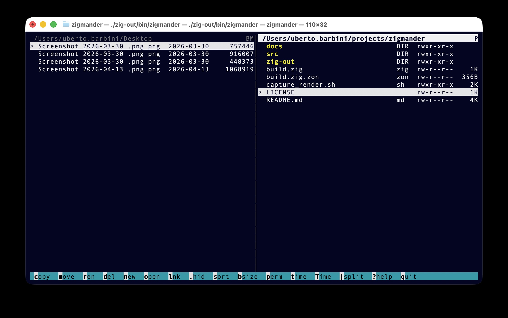

# Zigmander

A dual-panel terminal file manager written in Zig, inspired by Midnight Commander.

> **macOS only** — uses `open`, `pbcopy`, and POSIX `symlink`.



**Features:**
- Two side-by-side panels with independent sort, filter, and column settings
- Copy, move, rename, delete, symlink, and open files without leaving the terminal
- Toggle hidden files, sort by name/size, show permissions and dates per-panel
- Multi-entry selection for batch copy/move/delete
- Clipboard integration — pressing Enter on a file copies its path via `pbcopy`
- Horizontal/vertical split toggle

By Uberto Barbini — MIT License.

---

## Layout

Zigmander opens with two side-by-side panels, both starting in your home directory.  
Press `|` to toggle between vertical and horizontal split.

The **active panel** has a bold, reversed header showing the current path.  
The inactive panel is dimmed.  
Press `Tab` to switch focus between panels.

File and directory operations that involve a destination (copy, move, symlink) use
the **other panel** as the target directory.

---

## Navigation

| Key | Action |
|-----|--------|
| `↑` / `k` | Move cursor up |
| `↓` / `j` | Move cursor down |
| `Enter` / `→` | Enter directory / copy file path to clipboard |
| `←` / `Backspace` | Go to parent directory |
| `Tab` | Switch active panel |
| `Space` | Toggle selection on current entry |

Pressing `Enter` (or `→`) on a **file** copies its absolute path to the system clipboard
via `pbcopy`.

---

## File Operations

All operations act on the **selection** if any entries are marked; otherwise they act on
the entry under the cursor.  Copy, move, and symlink use the inactive panel's directory
as the destination.

| Key | Action |
|-----|--------|
| `c` | Copy to other panel |
| `m` | Move to other panel |
| `r` | Rename (opens a pre-filled prompt) |
| `d` | Delete (asks for confirmation) |
| `n` | New directory (name prompt) |
| `o` | Open with the default macOS application (`open`) |
| `l` | Create a symlink in the other panel pointing to this entry (name prompt) |

### Prompts and confirmations

- **Rename / New dir / Symlink**: a modal text field appears.  
  Type the name, press `Enter` to confirm, `Esc` or `Backspace`-to-empty to cancel.
- **Delete**: shows a confirmation modal.  
  Press `Enter` to confirm, `Esc` to cancel.
- Press `Esc` at any time to dismiss a modal or clear a status message.

---

## View Options

These toggles apply only to the **active panel** and are remembered for each panel
independently.

| Key | Effect |
|-----|--------|
| `.` | Show / hide hidden files (names starting with `.`) |
| `s` | Cycle sort order: name A→Z → name Z→A → size large→small → size small→large |
| `b` | Cycle size column: abbreviated (3K, 12M) → exact bytes → hidden |
| `p` | Toggle permissions column (`rwxr-xr-x`) |
| `t` | Toggle modified-date column (`YYYY-MM-DD`) |
| `T` | Toggle created-date column (`YYYY-MM-DD`) |
| `\|` | Toggle vertical / horizontal panel split |

### Panel header indicators

Active column flags are shown as single letters in the top-right corner of each panel:

| Indicator | Meaning |
|-----------|---------|
| `H` | Hidden files visible |
| `B` | Size column in exact-bytes mode |
| `P` | Permissions column shown |
| `M` | Modified-date column shown |
| `C` | Created-date column shown |
| `N↓` / `S↓` / `S↑` | Current sort order (name desc / size desc / size asc) |

---

## App Controls

| Key | Action |
|-----|--------|
| `?` | Open help screen (all shortcuts + build timestamp) |
| `Esc` | Dismiss status message or close any open modal |
| `q` | Quit |

---

## Selection

Press `Space` to mark one or more entries in the active panel.  
Selected entries are shown with a `*` marker and highlighted in a distinct colour.

When any entries are selected, **copy**, **move**, and **delete** operate on the full
selection.  **Rename**, **open**, and **symlink** always operate on the entry under
the cursor regardless of selection.

---

## Column Layout

Columns are reserved right-to-left in this order:

```
[cursor][sel]  [filename……]  [type]  [perms]  [btime]  [mtime]  [size]
```

- **cursor**: `>` on the current row, blank otherwise.
- **sel**: `*` on selected entries.
- **filename**: fills all remaining width; long names are truncated with the file
  extension preserved (e.g. `verylongname.zig` → `verylongna.zig`).
- **type**: `DIR` for directories, the extension without dot for files (up to 4 chars).
- **perms**, **btime**, **mtime**, **size**: optional columns toggled with `p`, `T`, `t`, `b`.

---

## Command-line Modes

Zigmander has two non-interactive diagnostic modes useful for testing and scripting:

```sh
# Plain-text table of all entries in a directory (permissions, dates, size)
zigmander --dump [path]

# Simulates the TUI column layout and prints it as ASCII text
zigmander --dump-render [path]
```

Both modes default to the current working directory if no path is given.

---

## Build from Source

Requires **Zig 0.15.2** and a macOS system (uses `open`, `pbcopy`, and POSIX `symlink`).

```sh
zig build
./zig-out/bin/zigmander
```

### Requirements

- macOS (uses `open` for the open action, `pbcopy` for clipboard, POSIX `symlink`)
- Zig 0.15.2
- A terminal emulator with at least 80 columns and 40 rows for the full help screen

---

## License

[MIT](LICENSE) — © 2026 Uberto Barbini
